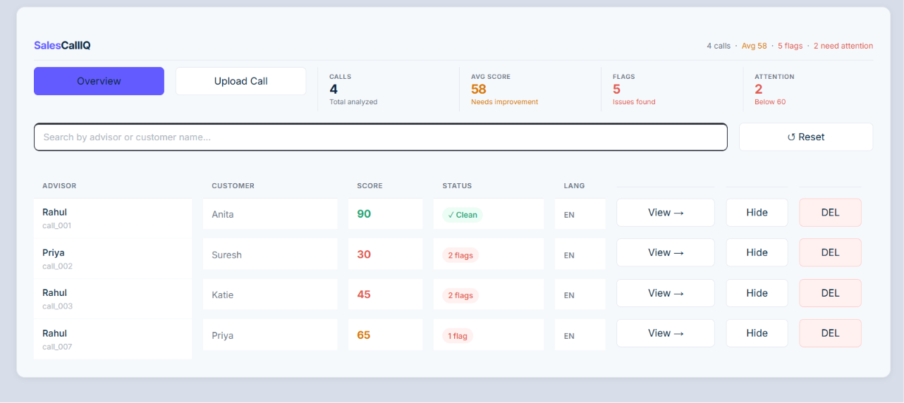
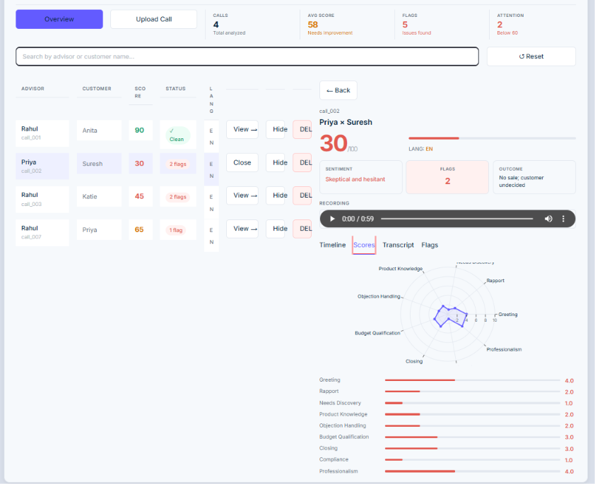
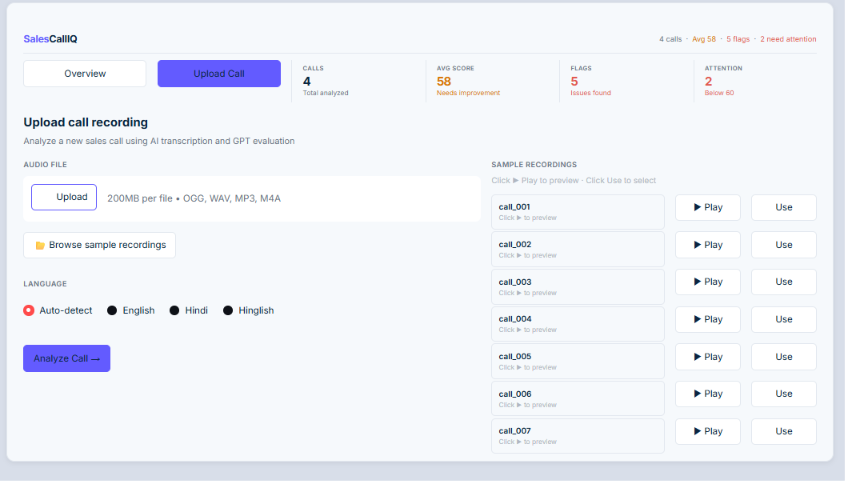

# 🎧 SalesCallIQ — AI Sales Call Analyzer

> An end-to-end AI-powered Sales Call Intelligence System built for the **FitNova AI Engineer Internship Take-Home Assignment**.

🔗 **Live Demo:** https://sales-call-iq.streamlit.app
💻 **GitHub:** https://github.com/Sanjay123sam456/AI-Sales-Call-Analyzer

---

## 📸 Screenshots

### Overview Dashboard


### Call Detail Panel


### Upload Page


---

## 🚀 Features

- 🎙️ **Deepgram Nova-3** Speech-to-Text with speaker diarization
- 🌐 **Multilingual** — English, Hindi & Hinglish support
- 🤖 **GPT-4.1-mini** evaluation via OpenRouter
- 📝 **Timestamped transcripts** with speaker labels
- 📊 **AI-generated insights** — strengths, improvements & red flags
- 🎯 **9-category scoring** with radar chart visualization
- 🔍 **Live search** with Hindi transliteration support
- 🔄 **Duplicate detection** via MD5 hash — zero token waste
- 🗑️ **Delete & re-run** — remove evaluation and re-analyze anytime
- 🎵 **Audio playback** directly in dashboard
- 📱 **Stripe-inspired UI** — clean, professional fintech design

---

## 🛠️ Tech Stack

| Layer | Technology |
|-------|-----------|
| Language | Python 3.12 |
| STT | Deepgram Nova-3 |
| LLM | GPT-4.1-mini via OpenRouter |
| Frontend | Streamlit |
| Charts | Plotly |
| Package Manager | uv |
| Deployment | Streamlit Cloud |

---

## 📂 Project Structure

```
AI-Sales-Call-Analyzer/
├── frontend/
│   ├── app.py                  ← Main app + CSS
│   └── components/
│       ├── terminal_nav.py     ← Nav bar + KPI strip
│       ├── call_list.py        ← Call table with search/delete
│       ├── detail_panel.py     ← Right panel (tabs: Timeline/Scores/Transcript/Flags)
│       └── upload_page.py      ← Upload form + sample recordings
├── data/
│   ├── audio/                  ← 7 original OGG recordings
│   ├── evaluations/            ← GPT evaluation JSONs
│   ├── transcripts/            ← Timestamped transcripts
│   └── metadata/               ← Language + call metadata
├── pipeline.py                 ← Core AI pipeline
├── .streamlit/secrets.toml     ← API keys (not committed)
└── README.md
```

---

## 🔄 Pipeline

```
Audio Recording
      │
      ▼
Deepgram Nova-3 (STT + Diarization)
      │
      ▼
Transcript Parser (speaker labels + timestamps)
      │
      ▼
GPT-4.1-mini Evaluation
      │
      ▼
Evaluation JSON (scores, flags, strengths, improvements)
      │
      ▼
Streamlit Dashboard (visualize + interact)
```

---

## 📌 Dataset

A custom synthetic dataset created specifically for this project:

- 7 realistic sales call recordings (self-written + self-recorded)
- English, Hindi, and Hinglish conversations
- Multiple scenarios — objections, follow-ups, successful bookings
- Covers advisor performance across 9 evaluation categories

---

## ▶️ Run Locally

```bash
# Clone the repo
git clone https://github.com/Sanjay123sam456/AI-Sales-Call-Analyzer
cd AI-Sales-Call-Analyzer

# Install dependencies
uv sync

# Add API keys to .streamlit/secrets.toml
# DEEPGRAM_API_KEY = "your_key"
# OPENROUTER_API_KEY = "your_key"

# Run the app
uv run streamlit run frontend/app.py
```

---

## 🔮 Future Enhancements

- SQLite / PostgreSQL for persistent storage
- Role-based dashboards (manager vs advisor view)
- Real-time call processing
- Batch upload support
- Email alerts for low-scoring calls
- Custom AI-Chatbot 

---

## 👨‍💻 Author

**Sanjay**
MCA (2025) — BIT Mesra | Aspiring AI / ML Engineer

[](https://github.com/Sanjay123sam456)